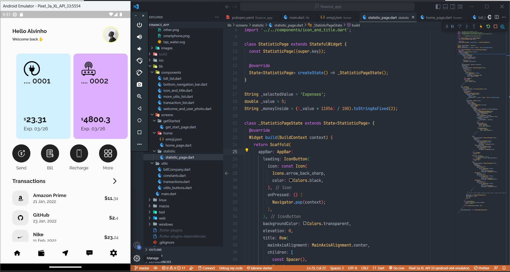

### Finance App

One of my initial projects developed with Flutter—a straightforward wallet app. I drew inspiration from Dribbble, making some modifications as part of my practice journey.
 ### Getting started

## Run Locally

Clone the project

```bash
  git clone [https://link-to-project](https://github.com/lauro-silva44/finance-app)
```

Go to the project directory

```bash
  cd finance-app
```

Install dependencies

```bash
  flutter pub get
```

Run the app

```bash
   flutter run
```


